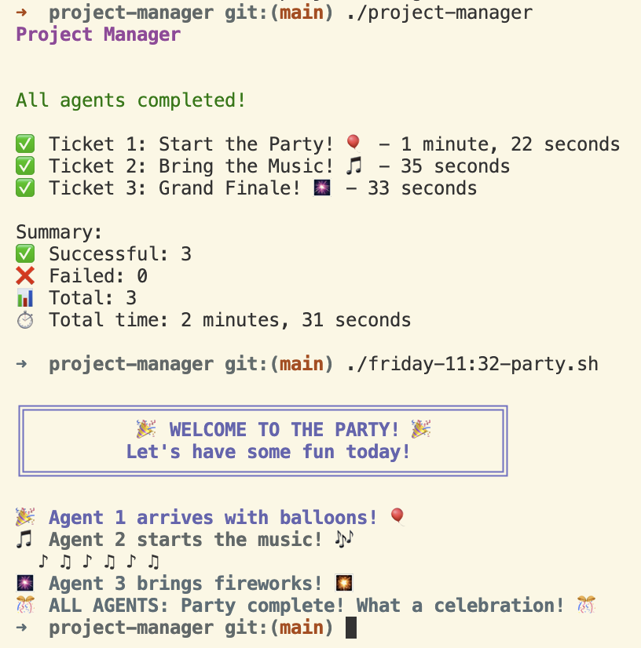

# Project Manager TUI

[](https://github.com/stefanmunz/project-manager/actions/workflows/ci.yml)
[](https://goreportcard.com/report/github.com/stefanmunz/project-manager)
[](https://opensource.org/licenses/MIT)

This is project-manager, a small terminal user interface (TUI) application for managing sequential execution of coding agents, built with [Bubble Tea](https://github.com/charmbracelet/bubbletea). This tool streamlines the process of running multiple AI agents against a codebase, with automatic file detection, visual progress tracking, and intelligent error handling.

## Key Features

- Multi-project support with folder-based organization
- Automatic detection of specification files
- Interactive file picker for missing files
- Agent selection (claude or custom command)
- Sequential ticket execution with configurable delays
- Real-time progress tracking with status indicators
- Flexible ticket parsing (supports various markdown formats)
- Shows ticket count during file validation
- Exponential backoff for API errors
- Visual countdown between agent executions
- Kill file mechanism for non-terminating agents

## Installation

### Using Go Install (Recommended)

```bash
go install github.com/stefanmunz/project-manager@latest
```

### Building from Source

1. Clone the repository:

```bash
git clone https://github.com/stefanmunz/project-manager.git
cd project-manager
```

2. Install dependencies:

```bash
go mod download
```

3. Build the application:

```bash
go build -o project-manager project-manager.go
```

This creates an executable `project-manager` file that you can run directly.

4. (Optional) Install development tools for contributing:

```bash
make install-tools
```

This installs golangci-lint and other development tools needed for linting and code quality checks.

### Requirements

- Go 1.21 or later
- Terminal with UTF-8 support

## Quick Start

1. Run the application:

```bash
./project-manager
```

2. The TUI will guide you through:
   - Selecting a project from available folders
   - Checking for required input files
   - Selecting missing files via an interactive file picker
   - Choosing your preferred coding agent
   - Confirming before execution
   - Monitoring real-time progress

There is a small example in the input folder that makes three agents contribute to a party script. If you have Claude installed (and you are YOLO enough to run it with --dangerously-skip-permissions), you can just check out the repository, build the tool and run it with the defaults. You can then watch the party script file and see how it is enhanced by each agent. Here is how it should look like:



## Usage

### Workflow

1. **Project Selection**: Choose from available project folders in the `input/` directory
2. **File Detection**: Automatically checks for required files in the selected project
3. **Interactive Selection**: If files are missing, presents an intuitive file picker
4. **Ticket Count Display**: Shows the number of tickets found during validation
5. **Agent Configuration**: Choose between Claude or a custom command
6. **Confirmation**: Review your configuration before execution
7. **Sequential Execution**: Runs agents one by one with configurable delays
8. **Progress Tracking**: Real-time status updates with visual indicators

## Project Structure

Projects are organized in folders within the `input/` directory:

```
input/
├── initial-implementation/
│   ├── specification.md
│   ├── tickets.md
│   └── standard-prompt.md
├── feature-x/
│   ├── specification.md
│   ├── tickets.md
│   └── standard-prompt.md
└── bugfix-y/
    ├── specification.md
    ├── tickets.md
    └── standard-prompt.md
```

Each project folder must contain:
- `specification.md` - Project specification
- `tickets.md` - Individual tickets for agents
- `standard-prompt.md` - Base prompt for all agents

## Ticket Format

The ticket parser is flexible and supports various markdown formats:

```markdown
# Ticket 1: Single hash
## Ticket 2: Double hash
### ticket 3: Lowercase
#### TICKET 4: Uppercase

## Ticket #5: With hash symbol
### Ticket 6 - With dash separator
# Ticket 7 No separator

## Ticket: Without number (auto-assigned)
```

All of these formats are recognized. Tickets are automatically numbered if no number is provided, and sorted by ticket number.

## Controls

- `↑/↓` or `j/k` - Navigate options
- `Enter` - Select/Confirm
- `Tab` - Focus text input (when selecting custom agent)
- `q` or `Ctrl+C` - Quit

## Testing Without Agents

For testing without relying on AI agents, you can use a simple shell script as the "agent". When prompted to select an agent, choose "Other" and enter one of these commands:

### Option 1: Simple echo command

```bash
bash -c 'echo "echo \"Agent worked on ticket\"" >> example-output.sh'
```

### Option 2: Create a test script

First create a mock agent script:

```bash
cat > mock-agent.sh << 'EOF'
#!/bin/bash
# Extract ticket number from the prompt
TICKET=$(echo "$1" | grep -o "ticket [0-9]" | grep -o "[0-9]")
echo "echo \"Agent $TICKET was here\"" >> example-output.sh
EOF
chmod +x mock-agent.sh
```

Then use `./mock-agent.sh` as your custom agent command.

### Option 3: Use a simple sleep command for testing flow

```bash
bash -c 'sleep 1 && echo "Task completed"'
```

This allows you to test the full flow of the project manager without depending on external AI services.

## Sequential Execution & Delays

The project manager ensures agents run sequentially with a configurable delay between executions:

- Default delay: 2 seconds between agents
- Exponential backoff: Delay doubles on API errors (max 30 seconds)
- Visual countdown shows remaining wait time
- Prevents API rate limiting issues

### Testing Sequential Execution

Use the included timestamp agent to verify sequential execution:

```bash
./timestamp-agent.sh
```

This script:

- Logs timestamps to `agent-execution.log`
- Shows exact start/end times for each agent
- Helps verify agents aren't running concurrently

Check the log after running:

```bash
cat agent-execution.log
```

You should see timestamps at least 2 seconds apart between agent completions and the next agent starting.

### Testing

The project includes a comprehensive test suite in the `test-scripts/` directory:

- **Mock Agents**: Simulate different agent behaviors (success, failure, debug)
- **Test Scripts**: Automated tests for various features
- **Kill File Testing**: Verify the agent termination mechanism

Available test agents:

1. **Debug Agent** (`test-scripts/debug-agent.sh`): Shows exactly what arguments are received
2. **Stdin Test** (`test-scripts/stdin-test.sh`): Tests reading prompt from stdin
3. **Failing Agent** (`test-scripts/failing-agent.sh`): Simulates API errors
4. **Mock Agent** (`test-scripts/mock-agent.sh`): Full-featured mock agent with kill file support

Run tests with:

```bash
./test-scripts/test-kill-mechanism.sh
./test-scripts/test-party-flow.sh
```

### Testing Error Handling

Use the failing agent to test error handling and exponential backoff:

```bash
./project-manager
# Select "Other" and enter: ./test-scripts/failing-agent.sh
```

This script simulates API overload errors. You should see:

- Failed tickets marked with ❌
- Delay increases after each failure (2s → 4s → 8s → 16s → 30s max)
- All tickets are attempted despite failures
- Visual countdown between retries

## Kill File Mechanism

The project manager handles non-terminating agents (like Claude) using a "kill file" mechanism:

1. **Agent prompts include**: "As your final task, create a file named 'killmenow.md' containing either 'success' or 'failure'"
2. **Async execution**: Agents run asynchronously while the manager monitors for the kill file
3. **Auto-termination**: When `killmenow.md` is detected, the agent process is killed and the file is deleted
4. **Status tracking**: Tickets are marked as completed/failed based on the file content

This ensures agents like Claude Code that don't auto-exit can still be managed effectively.

## Running Tests

The project includes unit tests for the ticket parsing functionality:

```bash
# Run all tests
go test -v

# Run tests with coverage
go test -v -cover

# Run benchmarks
go test -bench=. -benchtime=10s
```

The test suite covers:
- Various ticket formats (different hash levels, case sensitivity, separators)
- Edge cases (empty files, missing numbers, duplicates)
- File checking functionality
- Error handling

## Architecture & Design

The application is built using:

- **[Bubble Tea](https://github.com/charmbracelet/bubbletea)**: Terminal UI framework
- **[Lipgloss](https://github.com/charmbracelet/lipgloss)**: Styling and layout
- **[Bubbles](https://github.com/charmbracelet/bubbles)**: Pre-built TUI components

Key design decisions:

- Single-file architecture for simplicity
- Asynchronous agent execution with kill file mechanism
- Exponential backoff for API error handling
- Model-View-Update pattern for UI state management

## Contributing

We welcome contributions! Please see our [Contributing Guidelines](CONTRIBUTING.md) for details on:

- Code style and standards
- Testing requirements
- Pull request process
- Development setup

## License

This project is licensed under the MIT License - see the [LICENSE](LICENSE) file for details.

## Acknowledgments

- Built with [Charm](https://charm.sh/) libraries
- Inspired by the need for better AI agent orchestration
- Thanks to all contributors and users

## Support

- **Issues**: [GitHub Issues](https://github.com/stefanmunz/project-manager/issues)
- **Discussions**: [GitHub Discussions](https://github.com/stefanmunz/project-manager/discussions)
- **Documentation**: [Wiki](https://github.com/stefanmunz/project-manager/wiki)